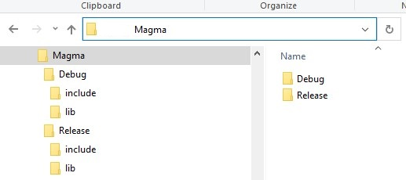

# MagmaSharp
.NET High Level API for MAGMA - Matrix Algebra for GPU and Multicore Architectures.
The project is supposed to be High Level API which means not all methods and capabilities will be implemented. In fact only selected and most important method are going to be exposed on .NET platform. The Library can run regardless of the CUDA present. In case the CUDA is not detected, the corresponded Lapack routine will be executed. On this way, the library can be execution engine for other .NET High Level APIs and libraries.

## Implementation of MagmaSharp
Currently the library supports MAGMA driver routines for general rectangular matrix:

1. ```gesv``` - solve linear system, AX = B, A is general non-symetric matrix,
2. ```gels``` - least square solve, AX = B, A is rectangular,
3. ```geev``` - eigen value solver for non-symetric matrix, AX = X lambda
4. ```gesvd```- singular value decomposition (SVD), A) U SIgma V^2H.

The library supports `float` and `double` value types only.

# Software requirements

The project is build on .NET Core 3.1 and .NET Standard 2.1. 

# Software (Native Libraries) requirements
In order to compile, build and use the library the following Native library is needed to be installed. 

- Intel MKL which can be downloaded at https://software.intel.com/content/www/us/en/develop/tools/math-kernel-library/choose-download.html

However,if you install the library as Nuget package,  the Intel MKL library is included as dependency in the Nuget package, so you don't have to install it. 

# How to use the library
 MagmaSharp is packed as Nuget, and can be added to your .NET project as ordinary .NET Nuget component. You don't have to worry about native libraries and dependencies. Everything is included in the package.
The package can be installed from this link, or just search MagmaSharp.

# How to Build MagmaSharp from the source

1. Download the MagmaSharp source code from the GitHub page. 
2. Reference Magma static library and put it to folder MagmaLib.


Magma static library can be built from the official page.

3. Open 'MagmaSharp.sln' with Visual Studio 2019.
4. Make Sure the building architecture is x64.
5. Restore Nuget packages.
5. Build and Run the Solution.,

### What is MAGMA- Matrix Algebra on GPU and Multicore Architectures
Magma is the c/c++ open source project developed and maintened by University of Tennessee and several other Universities. The goal of the MAGMA project is to create a new generation of linear algebra libraries that achieves the fastest possible time to an accurate solution on heterogeneous architectures, starting with current multicore + multi-GPU systems.
More information about MAGMA- can be found at https://icl.utk.edu/magma/software/index.html.


# How to Tutorials 

In this section we are going to provide you with the instruction how you can use the Library in your .NET projects.


